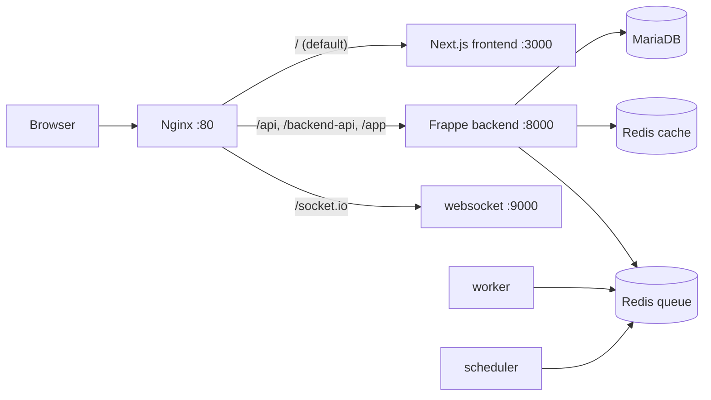

# Production Deployment Guide (Docker)

This deploys the full stack from [`docker/docker-compose.yml`](../docker/docker-compose.yml):
MariaDB, Redis (cache + queue), the Frappe/ERPNext backend (web + worker + scheduler +
websocket, all from one custom image), the Next.js frontend, and Nginx in front of both.



## Prerequisites

- Docker Engine 24+ and Docker Compose v2
- A server/VM (the target spec: private medical center, ~20 practitioners, is comfortably
  served by 4 vCPU / 8 GB RAM for the whole stack)
- A domain name pointed at the server if you want TLS (see [TLS](#tls) below)

## 1. Configure secrets

```bash
cd Health-C
cp docker/.env.example docker/.env
```

Edit `docker/.env` and set real values — **do not use the example passwords**:

| Variable | Purpose |
|---|---|
| `DB_ROOT_PASSWORD` | MariaDB root password (used once, at site creation) |
| `ADMIN_PASSWORD` | The Frappe `Administrator` account password on first site creation |
| `SITE_NAME` | Site hostname inside the bench, e.g. `healthc.local` (doesn't need to be publicly resolvable) |
| `FRONTEND_URL` | Public URL of the frontend, used for the Desk redirect and any links in emails |
| `HTTP_PORT` | Port Nginx binds on the host (80 by default; put a TLS-terminating proxy in front for 443, see below) |

## 2. Build and start

```bash
docker compose -f docker/docker-compose.yml --env-file docker/.env up -d --build
```

First boot creates the site and installs `erpnext` + `healthcare_erp` — this takes several
minutes (bench asset build + database migrations). Watch it with:

```bash
docker compose -f docker/docker-compose.yml logs -f backend
```

Once you see the gunicorn workers come up, visit `http://<server>/` — you land on the
Next.js login page. Log in as `Administrator` / the `ADMIN_PASSWORD` you set, then use the
Desk (`/app`, reachable at `http://<server>/app`) to create real Users and assign roles per
[`PERMISSIONS_MATRIX.md`](PERMISSIONS_MATRIX.md) — the Desk is for that kind of low-level
setup only; every other role is bounced back to the SPA (see `hooks.py`'s `role_home_page`).

## 3. Seed demo data (optional)

To load the demo dataset (~20 practitioners, patients, appointments, encounters, etc. — see
[`apps/healthcare_erp/healthcare_erp/patches/create_demo_data.py`](../apps/healthcare_erp/healthcare_erp/patches/create_demo_data.py)):

```bash
docker compose -f docker/docker-compose.yml exec backend \
  bench --site healthc.local execute healthcare_erp.patches.create_demo_data.execute
```

## 4. TLS

The bundled `nginx.conf` terminates plain HTTP only, on the assumption that a load
balancer / reverse proxy (or a sidecar like Caddy/Traefik, or your cloud provider's
managed TLS) sits in front of it in production. Point that layer at `HTTP_PORT` and
terminate TLS there. If you'd rather have Nginx terminate TLS itself, mount your
certificate/key into the `nginx` service and add a second `server { listen 443 ssl; }`
block redirecting from the existing `:80` block — the proxy rules themselves don't change.

## 5. Backups

- **Database + files**: use Frappe's built-in backup tooling from inside the backend
  container — `docker compose exec backend bench --site healthc.local backup --with-files`
  — and ship the resulting archive (under the `sites-data` volume) off-host on a schedule.
- **Volumes to snapshot**: `mariadb-data` (DB), `sites-data` (site config, private/public
  files, backups). Redis volumes are cache/queue state only and don't need backing up.

## 6. Scaling

- `worker` and `websocket` can be scaled horizontally (`docker compose up -d --scale
  worker=3`) — they're stateless beyond the shared Redis queue.
- `backend` (the gunicorn web process) can also be scaled; put it behind Nginx's default
  round-robin upstream (already how the `backend_upstream` block is written — just add more
  replicas and Docker Compose's embedded DNS resolves them all under the `backend` service
  name automatically when using `docker compose up --scale`).
- `mariadb` is the one stateful bottleneck — for real horizontal scale beyond a single VM,
  move to a managed MariaDB/MySQL-compatible service and point `DB_HOST` at it instead of the
  bundled container.

## 7. Updating

```bash
git pull
docker compose -f docker/docker-compose.yml --env-file docker/.env up -d --build
docker compose -f docker/docker-compose.yml exec backend bench --site healthc.local migrate
```

## Rollback

Every deploy is a new image build; roll back by checking out the previous commit and
re-running the same `up -d --build` — the site's data isn't touched by an image change.
Only a `bench migrate` that ran destructive schema changes would need a database restore
from backup, which is why step 5's backup cadence matters.
